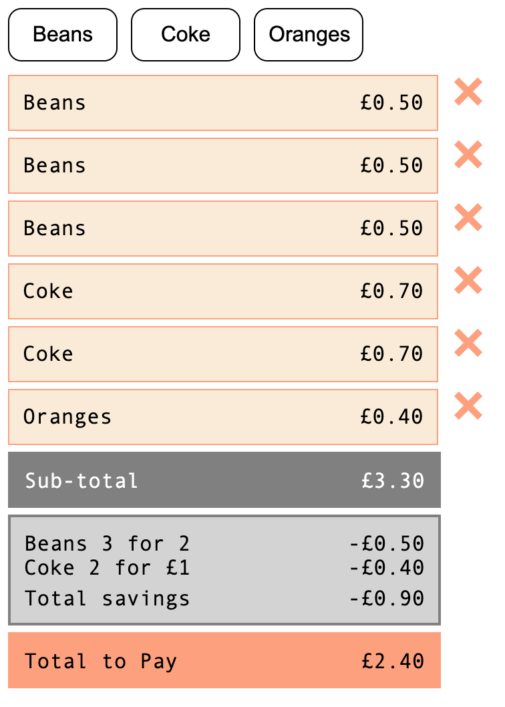

## Basket App

### Basket app functionality

- add/remove items
- show current sub-total
- show discount applied (3x beans => 50p, 2x Coke => 40p)
- show total to pay after discount if any

### Screenshot

### Completed

- some tests
- Store.js exposed via StoreContext
- some util function for formatting, mapping objects using native map/filter/reduce instead of lodash
- React hooks of useContext, useReducer, useState
- accessing data from Store state (useContext state/dispatch) or passing calculation as props

### Notes / to be done

- styling (JSS)
- actions folder with plain redux objects to be imported/used by dispatch?
- redux middleware, e.g thunk?
- simplify util functions
- refactor to useSelector / useDispatch React Redux hooks
- presentational components to be reusable containers with children props passed to them?
- more tests
